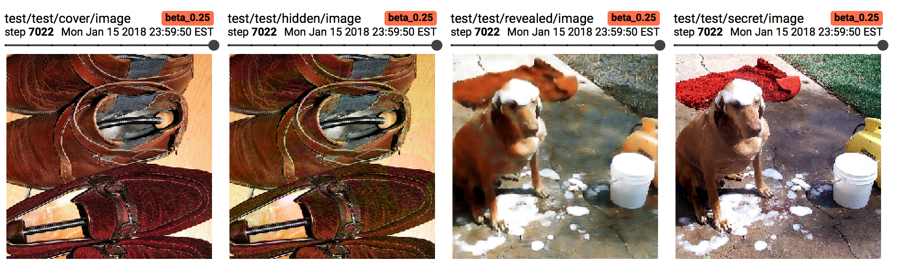

# Deep-Steganography-model

Tensorflow Implementation of Hiding Images in Plain Sight: Deep Steganography

Steganography is the science of Hiding a message in another message. In this case, a Picture is hidden inside another picture using Deep Learning

## Framework
The Framework takes in Two images. One is the secret image(extreme right) and another is the cover image(extreme left). The goal is to 'hide' the secret image in the cover image such that only the cover image is visible. This is the covered image(Center Left)
Then , this hidden image can be passed to a Revealing network, which can get the hidden image back(Center Right).

it is visually very hard to realise that the covered image is an image that has been tampered with. Yet the Reveal network can get back almost all of the important parts of the image. 
